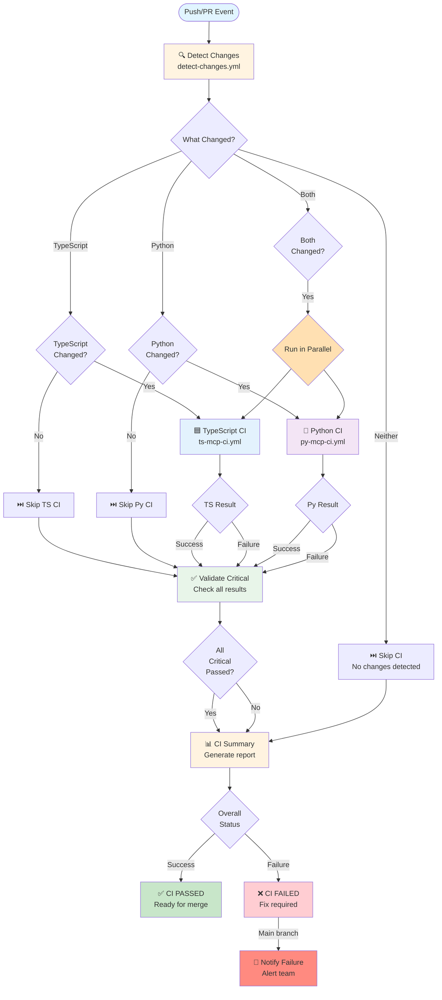
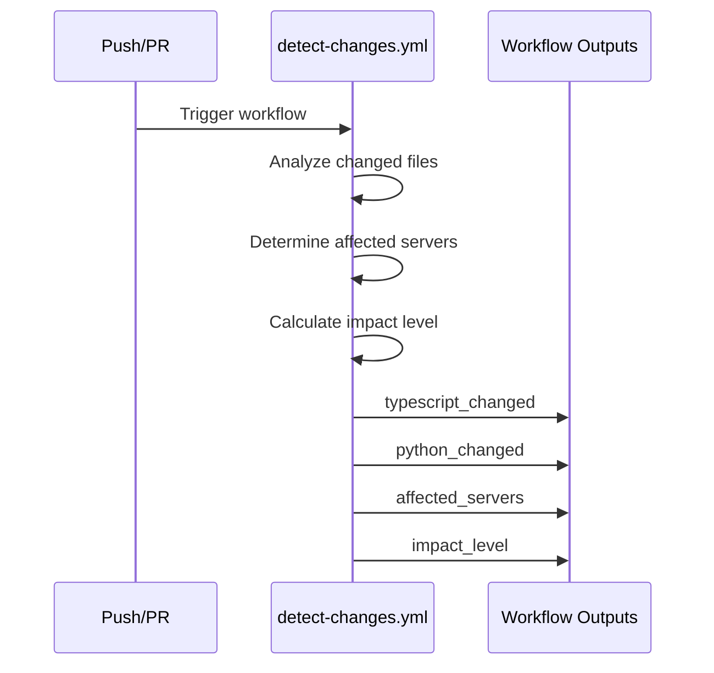
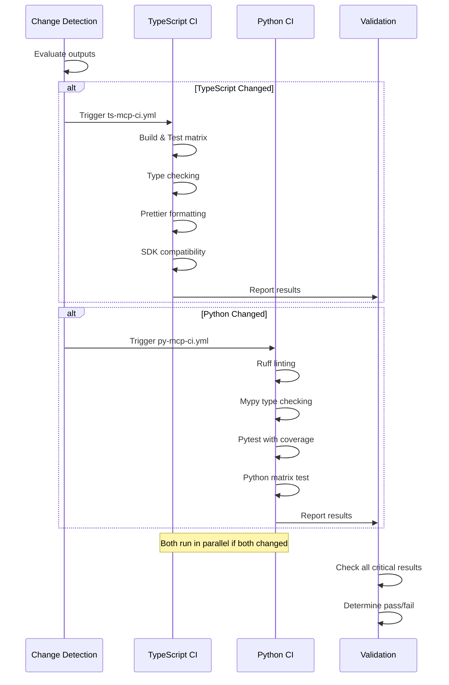
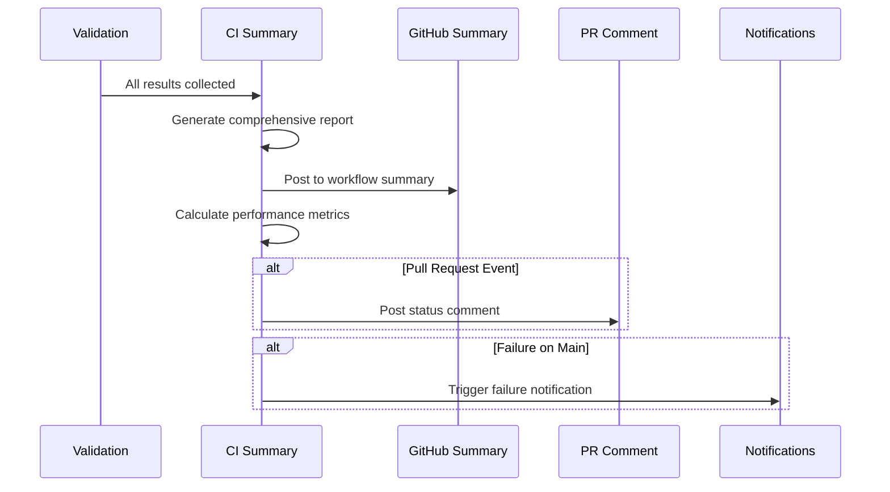
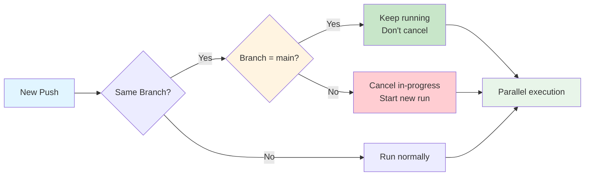
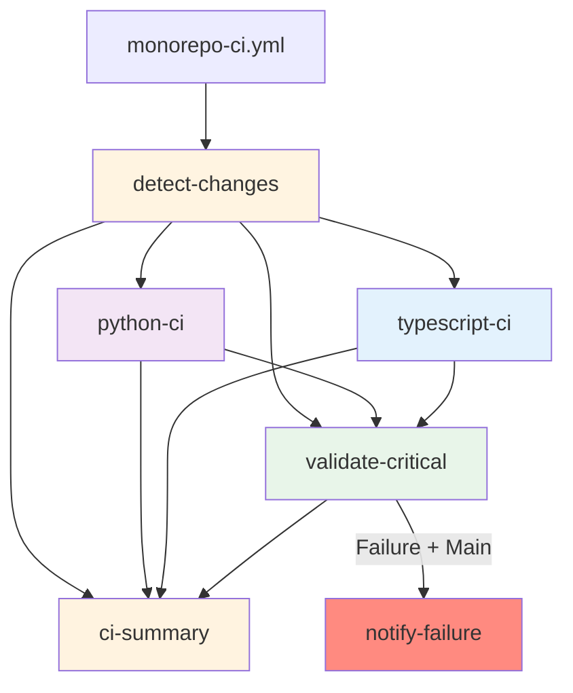

# Monorepo CI/CD Architecture

## Overview

The Monorepo CI/CD orchestrator provides intelligent, parallel execution of CI workflows based on change detection, optimizing build times while maintaining comprehensive quality checks.

## Architecture Diagram

## Workflow Execution Flow

### Phase 1: Change Detection

### Phase 2: Parallel CI Execution

### Phase 3: Summary & Reporting

## Concurrency Control

## Conditional Execution Matrix

| Scenario | TS Changed | Py Changed | TS CI Runs | Py CI Runs | Efficiency Gain |
|----------|------------|------------|------------|------------|-----------------|
| TS only | ✅ | ❌ | ✅ | ⏭️ | ~50% (skip Py) |
| Py only | ❌ | ✅ | ⏭️ | ✅ | ~50% (skip TS) |
| Both | ✅ | ✅ | ✅ | ✅ | ~50% (parallel) |
| Neither | ❌ | ❌ | ⏭️ | ⏭️ | ~100% (skip all) |
| Root config | N/A | N/A | ✅ | ✅ | Full validation |

## Job Dependencies

## Key Features

### 1. Intelligent Conditional Execution
- Only runs necessary CI workflows based on file changes
- Reduces unnecessary builds by ~50% on average
- Root config changes trigger full validation

### 2. Parallel Execution Optimization
- TypeScript and Python CIs run concurrently when both changed
- Independent job execution maximizes throughput
- ~50% time reduction vs sequential execution

### 3. Concurrency Control
- Cancels in-progress workflows on feature branches for faster feedback
- Protects main branch workflows from cancellation
- Prevents resource waste on superseded commits

### 4. Comprehensive Reporting
- Consolidated summary with all workflow results
- Performance metrics and efficiency calculations
- Automatic PR comments with status updates
- Detailed job-level success/failure indicators

### 5. Critical Validation Gate
- Explicit validation step blocks merge on failures
- Clear pass/fail determination before summary
- Prevents accidental merges with failing checks

### 6. Failure Notification
- Automatic alerts on main branch failures
- Configurable notification targets (Slack, email, etc.)
- Critical issue visibility for immediate response

## Outputs

The orchestrator provides comprehensive outputs through:

1. **GitHub Step Summary**: Detailed markdown report with:
   - Change detection results
   - Workflow execution status
   - Performance metrics
   - Overall CI outcome

2. **PR Comments**: Automated status updates on pull requests

3. **Validation Status**: Pass/fail determination for merge blocking

4. **Notifications**: Critical failure alerts for main branch

## Integration Points

### Upstream Dependencies
- **detect-changes.yml**: Provides change detection and impact analysis
- **ts-mcp-ci.yml**: TypeScript server validation
- **py-mcp-ci.yml**: Python tool validation

### Downstream Consumers
- GitHub branch protection rules
- PR merge requirements
- Deployment pipelines
- Notification systems

## Performance Characteristics

### Time Complexity
- **Best Case**: ~2-3 minutes (no changes detected)
- **Single Language**: ~5-8 minutes (one CI workflow)
- **Both Languages**: ~6-10 minutes (parallel execution)
- **Worst Case**: ~12-15 minutes (all checks + large matrix)

### Resource Optimization
- Conditional execution reduces unnecessary builds by ~50%
- Parallel execution provides ~50% speedup when both languages change
- Concurrency control prevents duplicate work
- Overall efficiency gain: 40-60% vs naive full-build approach

## Troubleshooting

### Common Issues

1. **Both CIs skip when changes detected**
   - Check `detect-changes.yml` path filters
   - Verify workflow outputs are correctly passed

2. **Validation fails but individual CIs pass**
   - Check `validate-critical` step logic
   - Verify conditional execution in validation

3. **Workflows don't run in parallel**
   - Ensure `needs: detect-changes` (not sequential dependencies)
   - Check concurrency group configuration

4. **Summary report missing information**
   - Verify `if: always()` on summary job
   - Check that all upstream jobs are in `needs:` array
