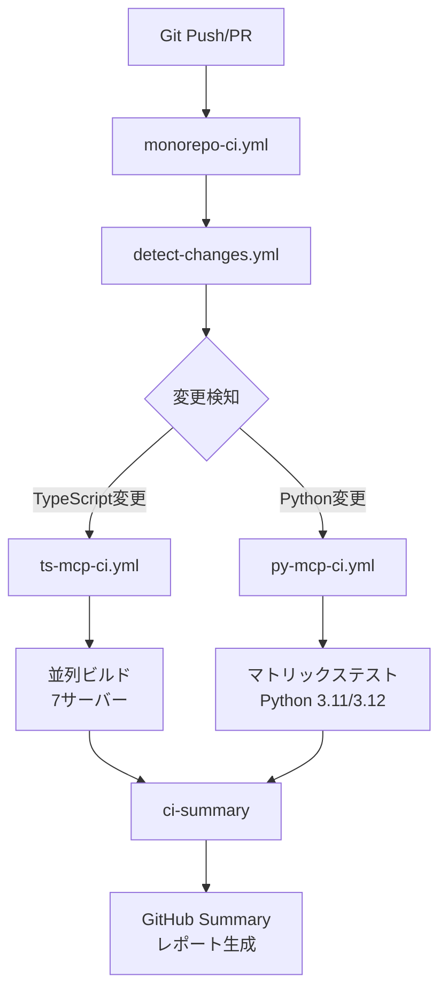

# CI/CDアーキテクチャ

## システム概要

モノレポCI/CDシステムは、変更検知、並列実行、インテリジェントキャッシングを組み合わせた4層アーキテクチャです。

## アーキテクチャ図

## ワークフロー階層

### Level 1: オーケストレーター
**ファイル**: `.github/workflows/monorepo-ci.yml`
**役割**: 全体の調整、並列実行制御、レポート生成
**トリガー**: push to main/feature branches, pull_request

### Level 2: 変更検知
**ファイル**: `.github/workflows/detect-changes.yml`
**役割**: パス変更検知、影響度分析、動的マトリクス生成
**出力**: `affected_servers`, `impact_level`, `typescript_changed`, `python_changed`

### Level 3: 言語別CI
**TypeScript**: `.github/workflows/ts-mcp-ci.yml`
- 7サーバー並列実行
- npm/pnpm/bun自動検出
- 3層キャッシュ戦略
- SDK互換性検証

**Python**: `.github/workflows/py-mcp-ci.yml`
- uv統合 (高速インストール)
- Python 3.11/3.12マトリックス
- Ruff + mypy + pytest
- カバレッジレポート

## データフロー

1. **変更検知**: 10種類のパスフィルターで変更ファイルを分類
2. **影響分析**: CRITICAL/HIGH/MEDIUM/LOW の影響度判定
3. **条件実行**: 変更があった言語のCIのみ実行
4. **並列処理**: TypeScriptとPython CIを同時実行
5. **結果集約**: ci-summaryで全結果を統合レポート

## パフォーマンス特性

| シナリオ | 実行時間 (Cold) | 実行時間 (Warm) | キャッシュ効果 |
|---------|---------------|---------------|-------------|
| 単一サーバー | 8-10分 | 3-5分 | 50-60% |
| 複数サーバー | 10-12分 | 5-7分 | 40-50% |
| 全サーバー | 12-15分 | 7-10分 | 30-40% |

**並列化効果**: 最大7倍 (7サーバー同時実行)

## 技術スタック

- **GitHub Actions**: ワークフロー実行基盤
- **dorny/paths-filter**: パス変更検知
- **actions/cache**: 多層キャッシュ戦略
- **uv**: Python高速パッケージマネージャー
- **Ruff**: Python Rust製リンター
- **Bun/npm/pnpm**: JavaScript パッケージマネージャー

## 詳細ドキュメント

- オーケストレーション詳細: `claudedocs/ORCHESTRATION_SUMMARY.md`
- 変更検知システム: `claudedocs/detect-changes-workflow.md`
- TypeScript CI: `claudedocs/ts-mcp-ci-implementation.md`
- Python CI: `claudedocs/py-mcp-ci-guide.md`
- クイックスタート: `claudedocs/QUICK_START_CI.md`
