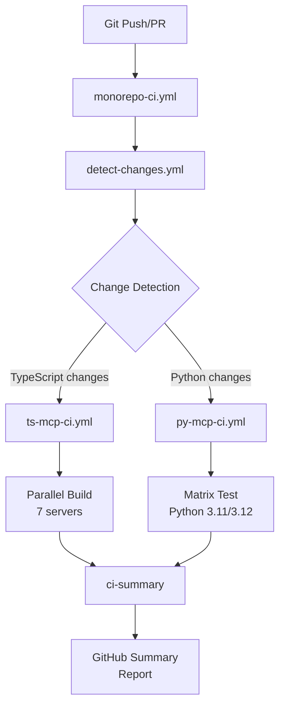

# CI/CD Architecture

## System Overview

The monorepo CI/CD system combines change detection, parallel execution, and intelligent caching in a 4-layer architecture.



## Workflow Hierarchy

### Level 1: Orchestrator
- **File**: `.github/workflows/monorepo-ci.yml`
- **Role**: Overall coordination, parallel execution control, report generation
- **Trigger**: push to main/feature branches, pull_request

### Level 2: Change Detection
- **File**: `.github/workflows/detect-changes.yml`
- **Role**: Path change detection, impact analysis, dynamic matrix generation
- **Outputs**: `affected_servers`, `impact_level`, `typescript_changed`, `python_changed`, `all_servers`

### Level 3: Language-Specific CI

**TypeScript** (`.github/workflows/ts-mcp-ci.yml`):
- 7 servers parallel execution
- npm/pnpm/bun auto-detection
- 3-layer cache strategy
- SDK compatibility checks

**Python** (`.github/workflows/py-mcp-ci.yml`):
- uv integration (fast installs)
- Python 3.11/3.12 matrix
- Ruff + mypy + pytest
- Coverage reporting

## Five-Phase Pipeline

```
Phase 1: Change Detection
    |
Phase 2: Parallel CI Execution (TypeScript & Python)
    |
Phase 3: Critical Job Validation
    |
Phase 4: Comprehensive Summary Report
    |
Phase 5: Failure Notification (main branch only)
```

## Change Detection System

### How It Works

The `detect-changes.yml` reusable workflow:
1. **Detects changes** in 7 TypeScript servers, Python tools, and root config
2. **Classifies impact** on a 5-level severity scale
3. **Generates outputs** in JSON format for downstream workflows
4. **Provides summary** in GitHub workflow UI

### 5 Workflow Outputs
```
affected_servers    -> JSON array of changed servers
impact_level        -> CRITICAL|HIGH|MEDIUM|LOW|NONE
typescript_changed  -> Boolean flag
python_changed      -> Boolean flag
all_servers         -> Complete server list
```

### Impact Level Logic
```
root_config changed?  -> CRITICAL
>3 servers changed?   -> HIGH
2-3 servers changed?  -> MEDIUM
1 server changed?     -> LOW
else                  -> NONE
```

### Path Filters

**TypeScript Servers (7)**:
- claude-mem, gdrive-mcp, markdownify-mcp
- mcp-obsidian-src, mcp-server-kubernetes
- Ollama-mcp, package

**Python Tools**: `tools/**/*.py`

**Root Configuration**: `package.json`, `tsconfig.json`, `.github/workflows/**`, `.npmrc`

## TypeScript CI Pipeline

### 6 Jobs
1. **detect-changes**: Identify affected servers and impact level
2. **build-and-test** (Matrix): Build and test each affected server
3. **typecheck** (Matrix): Validate TypeScript types
4. **prettier** (Matrix): Code formatting validation
5. **sdk-compatibility**: Validate MCP SDK versions
6. **ci-summary**: Generate comprehensive CI summary

### Package Manager Detection
```bash
if [ -f "bun.lockb" ]; then PM=bun
elif [ -f "pnpm-lock.yaml" ]; then PM=pnpm
else PM=npm
fi
```

### Cache Strategy
- **Dependencies**: `${{ runner.os }}-${{ pm }}-${{ server }}-${{ hashFiles(package.json) }}-${{ hashFiles(lockfile) }}`
- **Build artifacts**: `${{ runner.os }}-build-${{ server }}-${{ github.sha }}`
- 3-layer: global PM cache, node_modules, dist/

## Python CI Pipeline

### Structure
- **Phase 1**: detect-changes (reuse existing workflow)
- **Phase 2**: lint-and-test (Matrix: Python 3.11, 3.12)
  - uv sync, ruff check, ruff format, mypy (advisory), pytest with coverage
- **Phase 3**: ci-summary

### Key Technologies
- **uv**: Fast Python package manager (10-100x faster than pip)
- **Ruff**: Rust-based linter/formatter (replaces flake8+black)
- **pytest-cov**: Coverage reporting

## Conditional Execution Matrix

| Scenario | TS Changed | Py Changed | TS CI | Py CI | Gain |
|----------|-----------|-----------|-------|-------|------|
| TS only | Yes | No | Runs | Skip | ~50% |
| Py only | No | Yes | Skip | Runs | ~50% |
| Both | Yes | Yes | Runs | Runs | ~50% (parallel) |
| Neither | No | No | Skip | Skip | ~100% |
| Root config | N/A | N/A | Runs | Runs | Full validation |

## Performance Characteristics

| Scenario | Cold Cache | Warm Cache | Cache Effect |
|---------|-----------|-----------|-------------|
| Single server | 8-10 min | 3-5 min | 50-60% |
| Multiple servers | 10-12 min | 5-7 min | 40-50% |
| All servers | 12-15 min | 7-10 min | 30-40% |

**Parallelization effect**: Up to 7x (7 servers simultaneously)

## Concurrency Control

- Cancels in-progress workflows on feature branches for faster feedback
- Protects main branch workflows from cancellation
- Prevents resource waste on superseded commits

## Technology Stack

- **GitHub Actions**: Workflow execution
- **dorny/paths-filter**: Path change detection
- **actions/cache**: Multi-layer caching
- **uv**: Python package management
- **Ruff**: Python linting
- **Bun/npm/pnpm**: JavaScript package managers

## Integration Examples

### Basic: Conditional Job Execution
```yaml
jobs:
  detect:
    uses: ./.github/workflows/detect-changes.yml
  build-ts:
    needs: detect
    if: needs.detect.outputs.typescript_changed == 'true'
```

### Matrix-Based Testing
```yaml
jobs:
  test:
    needs: detect
    strategy:
      matrix:
        server: ${{ fromJson(needs.detect.outputs.affected_servers) }}
```

### Impact-Based Actions
```yaml
jobs:
  notify-critical:
    needs: detect
    if: needs.detect.outputs.impact_level == 'CRITICAL'
```

## Related Files

- `.github/workflows/monorepo-ci.yml` - Orchestrator
- `.github/workflows/detect-changes.yml` - Change detection
- `.github/workflows/ts-mcp-ci.yml` - TypeScript CI
- `.github/workflows/py-mcp-ci.yml` - Python CI
- `.github/scripts/validate-workflow.sh` - Validation script
